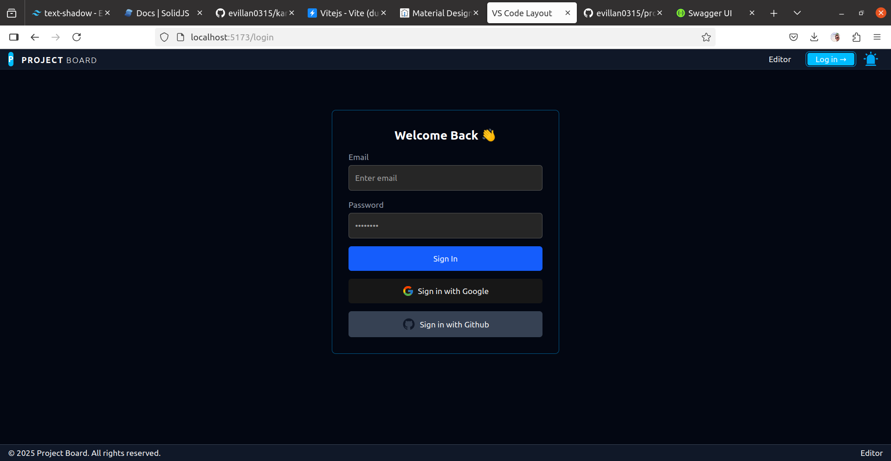
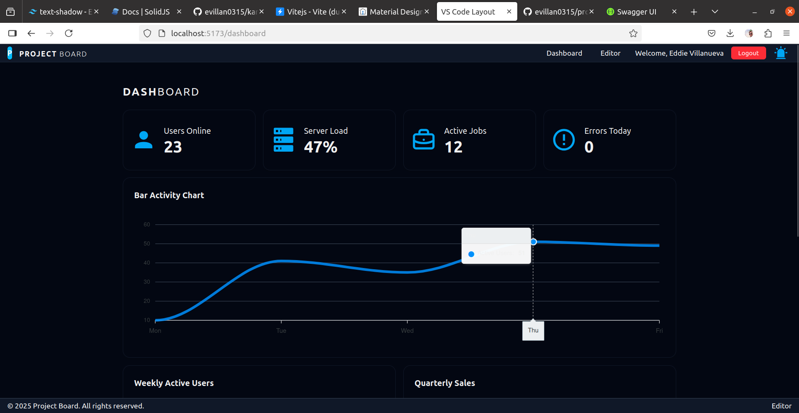

# Project Board

A developer-focused layout system interface, implemented using **TypeScript**, **Vite**, **SolidJS**, and **Tailwind CSS**.

---

## 📑 Table of Contents

* [📸 Screenshots](#📸-screenshots)
* [📁 Project Structure](#📁-project-structure)
* [🚀 Features Overview](#🚀-features-overview)

  * [🌐 Frontend Architecture](#🌐-frontend-architecture)

    * [📂 Main Routes](#📂-main-routes)
    * [🛠 Built-in Services](#🛠-built-in-services)
  * [🖥️ Developer Workspace](#🖥️-developer-workspace)
  * [⚙️ Settings System](#⚙️-settings-system)
  * [🔊 Text-to-Speech (TTS)](#🔊-text-to-speech-tts)
  * [💬 Modal System](#💬-modal-system)
  * [🔑 GitHub & Google OAuth Integration](#🔑-github--google-oauth-integration)

    * [GitHub OAuth](#github-oauth)
    * [Google OAuth](#google-oauth)
  * [📝 Markdown Features](#📝-markdown-features)

    * [📄 Rendering](#📄-rendering)
    * [✏️ Editing](#✏️-editing)
    * [⚙️ Extensibility](#⚙️-extensibility)
  * [🖥️ Developer Console Features](#🖥️-developer-console-features)

    * [🧑‍💻 Terminal](#🧑‍💻-terminal)
    * [🤖 AI Terminal](#🤖-ai-terminal)
    * [📋 Logger Panel](#📋-logger-panel)
    * [⚙️ Console Controls](#⚙️-console-controls)
    * [✨ Extensibility](#✨-extensibility-1)
  * [🎵 Media Downloader Features](#🎵-media-downloader-features)
  * [🎥 Screen Capture & Recording Features](#🎥-screen-capture--recording-features)
  * [📂 File Manager & File Explorer Features](#📂-file-manager--file-explorer-features)

    * [🌳 Tree Structure Rendering](#🌳-tree-structure-rendering)
    * [🖱️ Contextual Actions](#🖱️-contextual-actions)
    * [⚙️ Inline Operations](#⚙️-inline-operations)
    * [🧠 File Type Awareness](#🧠-file-type-awareness)
    * [🔄 Real-time Store Integration](#🔄-real-time-store-integration)
    * [🛡️ UX & Accessibility](#🛡️-ux--accessibility)
    * [🧩 Extensibility](#🧩-extensibility-2)
  * [🛠️ Editor Action Buttons Features](#🛠️-editor-action-buttons-features)

    * [💾 Save File](#💾-save-file)
    * [💻 Terminal Integration](#💻-terminal-integration)
    * [📂 Tool Dropdown Menu](#📂-tool-dropdown-menu)
    * [⚙️ Customization & Extensibility](#⚙️-customization--extensibility)
    * [✨ UX & Design](#✨-ux--design)
* [🧑‍💻 Tech Stack](#🧑‍💻-tech-stack)

  * [Frontend](#frontend)
  * [Backend](#backend)
* [📡 API Endpoints](#📡-api-endpoints)
* [🛠️ Roadmap](#🛠️-roadmap)
* [🤝 Contributing](#🤝-contributing)
* [📄 License](#📄-license)
* [📫 Contact](#📫-contact)

---


## 📸 Screenshots

| Login Page                          | Homepage                                  | Dashboard                            |
| ----------------------------------- | ----------------------------------------- | ------------------------------------ |
|  |  |  |


---

## 📁 Project Structure

```
project-board/
├── .gitignore
├── README.md
├── index.html
├── package.json
├── pnpm-lock.yaml
├── pnpm-workspace.yaml
├── prettier.config.cjs
│
├── dist/                          # Compiled output files
│
├── libs/                          # Utility scripts
│   ├── generateStructure.ts
│   └── generateStructureRunner.ts
│
├── src/
│   ├── App.tsx                    # Root app component
│   ├── app.css                    # Global styles
│   │
│   ├── components/
│   │   ├── layouts/               # Layout components (VSCode-like panels)
│   │   ├── file/                  # File manager & tabs
│   │   ├── terminal/              # Terminal shell component
│   │   ├── tts/                   # Text-to-Speech form and player
│   │   ├── modal/                 # Modal system (Settings, Confirm, Alert)
│   │   └── ui/                    # Reusable UI elements (Button, ToggleSwitch, etc)
│   │
│   ├── contexts/                  # SolidJS context providers
│   ├── hooks/                     # Custom hooks
│   ├── stores/                    # App-wide stores (e.g., editorContent)
│   ├── services/                  # API clients & modal service
│   ├── constants/                 # App constants (e.g., settingsTabs)
│   ├── utils/                     # Helper utilities (e.g., validators)
│   └── data/                      # Static data
```

---

## 🚀 Features Overview

### 🌐 Frontend Architecture

The frontend is powered by **SolidJS**, featuring:

- Client-side routing with protected and public paths.
- Context-based theme and authentication management.
- A dynamic layout system that supports global header, footer, and modal services.
- Code-splitting and lazy-loading ready (via `Suspense`).

#### 📂 Main Routes
- `/` → Public home
- `/login` → Authentication
- `/dashboard` → User dashboard (protected)
- `/editor` → Markdown/code editor (protected)

#### 🛠 Built-in Services
- **Toaster** → Real-time notifications.
- **Modal** → Centralized modal service.
- **SocketIO integration** → For streaming downloads & real-time updates.

> ⚠️ _All sensitive routes are guarded. Ensure API endpoints are secured on the backend as well._


### 🖥️ Developer Workspace

* **Visual Studio Code-like layout:** Collapsible sidebars, header, footer, resizable panels, and file tabs.
* **CodeMirror / Monaco editor integration:** Syntax highlighting, autocomplete, and more.
* **Resizable terminal shell:** Embedded terminal (xterm.js) with backend WebSocket support.
* **Dynamic file manager:** Browse, open, rename, reorder files and folders.

### ⚙️ Settings System

* **Global app settings:** Theme, font size, autosave, AI options, and player visibility.
* **Modal-based UI:** Settings modal with tabs (`Theme`, `AI`, `General`, `Terminal`).
* **Validation:** Configurable settings validated before save with confirmation dialog.

### 🔊 Text-to-Speech (TTS)

* **Prompt input:** Enter text to synthesize speech.
* **Language + voice selection:** Multi-language, multi-speaker support.
* **Playback + download:** Audio preview and download via REST API.

### 💬 Modal System

* **Global modal service:** Alert, confirm, and settings dialogs managed through a central service.
* **Accessible + layered modals:** Proper z-index handling ensures dialog priority.

### 🔑 GitHub & Google OAuth Integration

#### GitHub OAuth

* **`/api/auth/github`** – Initiates GitHub OAuth2 login.
* **`/api/auth/github/callback`** – Handles callback, validates profile, generates JWT, and sets cookie.
* Enables future features:

  * Accessing user repositories
  * Pushing commits programmatically
  * GitHub-linked operations via app

> ⚠️ GitHub tokens are stored securely and not exposed to the client.

#### Google OAuth

* **`/api/auth/google`** – Initiates Google OAuth2 login.
* **`/api/auth/google/callback`** – Handles callback, validates profile, generates JWT, and sets cookie.
* Enables future features:

  * Google Drive / Calendar / Gmail integration
  * Google-linked operations via app

> ⚠️ Google tokens are stored securely and not exposed to the client.

---

### 📝 **Markdown Features**

The system provides rich support for **Markdown viewing and editing**, seamlessly integrated into the editor environment:

---

#### 📄 **Rendering**

* Parses and renders Markdown content to HTML using `marked`.

* Applies **responsive, theme-aware styling** with Tailwind CSS `prose` classes and custom styles.

* **Syntax highlights code blocks using PrismJS**, supporting:

  ```
  JavaScript, TypeScript, Python, CSS, HTML, JSON, YAML, Bash, Shell, HTTP.
  ```

* Automatically displays language tags (e.g., `TypeScript`, `Python`) on code blocks.

* Includes a **copy-to-clipboard button** for each code block, with visual feedback (📋 → ✅).

* Automatically cleans up DOM content on unmount to ensure performance and prevent memory leaks.

---

#### ✏️ **Editing**

* **Supports live Markdown editing** via integrated **CodeMirror** editor.
* Users can modify Markdown source directly within the app.
* Changes in CodeMirror **update the rendered Markdown preview in real-time**, providing immediate feedback.
* CodeMirror editor includes:

  * Syntax highlighting for Markdown.
  * Customizable key bindings.
  * Theme support aligned with the app’s light/dark mode.

---

#### ⚙️ **Extensibility**

* Designed for easy integration with additional features such as:

  * Markdown linting and validation.
  * Export to `.md` or `.html`.
  * Embedding diagrams, LaTeX, or charts.

---

### 🖥️ **Developer Console Features**

An integrated developer console providing multiple tools for development and debugging, inspired by IDE consoles:

---

#### 🧑‍💻 **Terminal**

* Fully interactive terminal supporting shell command execution.
* Real-time streaming of output, simulating a native shell experience.
* Designed for extensibility to integrate with system or container environments.

---

#### 🤖 **AI Terminal**

* Dedicated terminal panel for interacting with AI-powered commands.
* Supports natural language input to assist with code generation, analysis, or automation tasks.
* Easily extendable for future AI integrations (e.g., code explanation, linting suggestions).

---

#### 📋 **Logger Panel**

* Displays structured log output in real-time.
* Helps monitor backend processes, server logs, or custom event streams.
* Supports styled log levels (info, warning, error) for readability.

---

#### ⚙️ **Console Controls**

* Tabbed interface to switch between `Terminal`, `AI Terminal`, and `Logs` views.
* Integrated **Settings button** opens developer settings contextually for the active tool.
* Tailwind-powered dark mode styling, with hover and active state feedback.
* Icon-enhanced tabs using `@iconify-icon/solid` for clear visual distinction.

---

#### ✨ **Extensibility**

* Modular design supports adding more developer tools (e.g., profiler, performance metrics).
* Easy integration with the global app settings and other panels.

---


### 🎵 **Media Downloader Features**

An interactive audio/video downloader panel with real-time progress tracking, leveraging **SolidJS** + **Socket.IO** for seamless backend communication:

---

#### 🌐 **Provider Support**

* Supports downloading from major platforms such as **YouTube** and **Bilibili**.
* Easily extendable for additional media providers.

---

#### ⚙️ **Customizable Options**

* Select media format: **MP3**, **WAV**, **M4A**, **WebM**, **MP4**, **FLV**.
* Choose provider at runtime.
* Option to enable **cookie-based access** for authenticated content.

---

#### 📈 **Real-time Progress**

* Displays live progress updates via **socket.io** events.
* Visual progress bar with percentage indicator.
* Handles `download_progress`, `download_complete`, and `download_error` events gracefully.

---

#### 🎬 **Built-in Player**

* Automatically renders a **Video.js player** for video formats (MP4, WebM, FLV).
* Embeds native `<audio>` player for audio formats.
* Streams media directly from the backend upon completion.

---

#### 🛡️ **Robust UX**

* Disables download button during active download to prevent duplicates.
* Provides clear error reporting if extraction fails.
* Responsive and theme-aware styling (Tailwind CSS + dark mode support).

---

#### 🧩 **Extensibility**

* Designed for easy integration of additional features like download queue management or playlist support.
* Clean separation of concerns for backend (media processing) and frontend (UI + socket events).

---

#### 📝 **Notes**

* The backend server is responsible for handling the actual media extraction and conversion.
* Error handling is minimal and can be improved to provide more informative error messages to the user.
* The component can be extended to support more media providers and output formats.
* Consider adding input validation to ensure that the user enters a valid URL.
* The video and audio players are conditionally rendered based on the selected output format.

---


### 🖥️ Terminal & AI Integration Features

The editor provides an advanced AI-powered terminal experience using **xterm.js** and Google Gemini, seamlessly integrated into the frontend:

* **Interactive Terminal**

  * Powered by `xterm.js` with customizable themes and responsive resizing using the FitAddon.
  * Supports standard terminal input, cursor blinking, and colored text output.
  * Built-in command history navigation (arrow keys).

* **AI-Powered Features**

  * Real-time interaction with Gemini AI for text-based commands and responses.
  * Supports:

    * `/new` → Start a fresh conversation.
    * `/system <instruction>` → Set a custom system instruction/persona for Gemini.
    * `/persona bash-admin` → Load an expert Bash/Linux administrator persona.
    * `/file <prompt>` → Analyze the current editor file using AI and return context-aware results.

* **Conversation Management**

  * Automatically generates and tracks `conversationId` for each session.
  * System instructions are persisted per conversation for consistent AI behavior.

* **File-Aware AI Analysis**

  * Sends current editor content to Gemini along with custom prompts for code/file review, summaries, or transformations.
  * Supports multi-language files, dynamically detected from editor state.

* **Dynamic Prompting**

  * Gemini prompt customizable at runtime via terminal commands.
  * Visual feedback for AI responses, file analysis results, and error messages.

* **Extensible System Instructions**

  * Predefined personas (e.g., **Bash Admin**, **DevOps Expert**, **Fullstack Developer**) with the option to define custom instructions on-the-fly.

---

#### ⚙️ Additional Notes

* The terminal component is **fully reactive** and automatically cleans up resources on unmount to avoid memory leaks.
* AI file analysis uses **base64 encoding** and secure form-data transfer for file uploads.
* The backend endpoints `/gemini/file/generate-text` and `/gemini/file/generate-file` handle the heavy lifting for AI processing.
* Terminal commands are designed to be easily extensible. Future additions (e.g., `/persona devops-expert`) can be integrated without major changes.
* **Error handling** is integrated into the terminal output stream for clarity during interactions.

---


### 🎥 Screen Capture & Recording Features

The application provides built-in screen capture and recording functionality, integrated directly into the UI for seamless developer workflows:

* **Screen Screenshot**

  * One-click screenshot capture of the current screen.
  * Captured image is stored server-side and accessible via the media API.
  * Real-time toast notification displays a thumbnail of the captured screenshot.

* **Screen Recording**

  * Start and stop screen recording with a single button.
  * Recording files are saved server-side with a unique timestamped filename.
  * Visual indicators show recording status (`🟢 Recording started`, `🔴 Recording stopped`).
  * Toast notification displays the recording file link upon completion.

* **API Integration**

  * Uses backend API endpoints:

    * `GET /api/screen/record-start` — Initiates a new screen recording.
    * `GET /api/screen/record-stop` — Stops an ongoing recording.
    * `GET /api/screen/capture` — Captures a screenshot.
  * All media files are served via the `/api/media/` endpoint.

* **User Feedback**

  * Toast notifications provide immediate visual feedback for all screen capture and recording actions.
  * Dynamic button icon and label updates indicate the current recording state.

* **Extensibility**

  * Easily extendable to support additional recording options (e.g., region selection, audio capture).
  * Backend file storage paths and filenames are dynamically generated for each action.

---

⚡ *Tip:* The component ensures user clarity and feedback by disabling ambiguity in state transitions between recording and idle states.

---

### 📂 **File Manager & File Explorer Features**

The editor includes a fully interactive file manager panel, designed for productivity and inspired by modern IDE explorers:

---

#### 🌳 **Tree Structure Rendering**

* Dynamically builds and renders a hierarchical tree of files and folders.
* Automatically sorts directories above files and orders items alphabetically.
* Supports nested folders and lazy-loading of child nodes as needed.

---

#### 🖱️ **Contextual Actions**

* **Right-click context menu** provides actions based on file/folder type:

  * Open file or navigate into folder.
  * Create new file or folder (for directories).
  * Rename files and folders (inline editable).
  * Delete files or folders with confirmation.
* Context menu dynamically displays metadata:

  * Type (file/folder)
  * Size (for files)
  * Creation and modification dates (formatted `DD/MM/YYYY HH:mm:ss`)

---

#### ⚙️ **Inline Operations**

* **Inline renaming** of files/folders, with keyboard (Enter/Escape) and blur handling.
* Folder expansion/collapse with chevron toggle.
* Automatically refreshes directory contents after rename or delete actions.
* Displays loading indicator when fetching subdirectory contents on demand.

---

#### 🧠 **File Type Awareness**

* Uses `@iconify-icon/solid` + `vscode-icons` to display file-type specific icons:

  * Recognizes common types like **JavaScript**, **TypeScript**, **Markdown**, **JSON**, **HTML**, **CSS**, **Python**, **Java**, **C++**, **config**, images, etc.
  * Custom fallback icon for unknown file types.
  * Dynamic folder icons showing open/closed state.

---

#### 🔄 **Real-time Store Integration**

* Connected to `editorContent` store for:

  * Tracking current directory, open file path, unsaved changes.
  * Managing open tabs and editor focus events.

* Dispatches custom events (e.g., `editor-load-file`) for seamless editor integration.

---

#### 🛡️ **UX & Accessibility**

* Fully keyboard-navigable inline renaming.
* Responsive layout with truncation for long file names.
* Visual feedback on hover, active, and editing states.
* Works in light/dark themes with Tailwind styling.

---

#### 🧩 **Extensibility**

* Designed to easily extend with features like:

  * Drag-and-drop reordering or moving of files/folders.
  * Multi-select for batch operations.
  * Search/filter functionality within the file tree.
  * File/folder permissions display and management.

---

⚡ *Tip:* The File Manager leverages a clean separation of concerns between data fetching, rendering, and UI interactions, making it easy to maintain and extend.

---


### 🛠️ **Editor Action Buttons Features**

The editor toolbar provides quick-access action buttons and dropdown tools designed to enhance developer productivity:

---

#### 💾 **Save File**

* **Save icon button** appears when unsaved changes are detected for the active file.
* One-click save triggers the `saveFile` utility, persisting file contents through the backend API.
* Provides user feedback via integrated toast notifications.

---

#### 💻 **Terminal Integration**

* Quick-launch **local terminal** button (powered by xterm.js).
* Allows toggling terminal modes (`local`, `AI`, or `none`) depending on developer workflow.
* Terminal mode switcher seamlessly integrates with editor state.

---

#### 📂 **Tool Dropdown Menu**

A powerful dropdown menu offering various code utilities:

* **Code Tools (AI & Backend) powered**

  * 🗑️ **Remove Comments** — Strips inline and block comments from code for cleaner output.
  * 🎨 **Format Code** — Formats code using predefined style rules.
  * ⚡ **Optimize Code** — Performs code optimizations (e.g., remove redundancies, improve structure).
  * 🧐 **Analyze Code** — Static analysis to identify potential issues or improvements.
  * 🔧 **Repair Code** — Attempts automatic fixes for common code errors.

* **Generate Docs (AI & Backend) powered**

  * 📄 **Inline Documentation** — Generates inline comments or JSDoc-style annotations.
  * 📖 **Generate Documentation** — Opens documentation drawer for structured doc generation.

* **Menu Styling**

  * Includes headers (`Code Tools`, `Generate Docs`) and dividers for clarity.
  * Uses `@iconify-icon/solid` and `mdi` icons for intuitive visual cues.

---

#### ⚙️ **Customization & Extensibility**

* Tool actions are defined modularly (via `editorActions`) for easy extension (e.g., add linting, refactoring tools).
* Supports integration with external drawers:

  * **Documentation Drawer**
  * **AI Assistant / Chat Drawer**
  * **Markdown Preview Drawer**
* Drawer visibility controlled via props, promoting clean separation of concerns.

---

#### ✨ **UX & Design**

* Tailwind CSS-based styling for consistent theme and variant control.
* Buttons are grouped with spacing (`gap-2`) for clarity and responsiveness.
* Dropdown menu designed for accessibility and ease of navigation.

---

⚡ *Tip:* The modular design of the action buttons ensures that new code utilities or external integrations (e.g., linters, formatters, AI tools) can be added with minimal changes.

---


## 🧑‍💻 Tech Stack

### Frontend

* **SolidJS**
* **Tailwind CSS**
* **xterm.js**
* **Monaco Editor / CodeMirror**
* **Vite**

### Backend

* **NestJS**
* **REST APIs + WebSocket Gateway**
* **Google Cloud TTS API**
* **GitHub + Google OAuth2**

---

## 📡 API Endpoints

| Method | Endpoint                    | Description                      |
| ------ | --------------------------- | -------------------------------- |
| POST   | `/file/read`                | Reads file content for editor    |
| POST   | `/google-tts/generate`      | Generates speech audio from text |
| GET    | `/api/auth/github`          | Initiates GitHub login           |
| GET    | `/api/auth/github/callback` | Handles GitHub login             |
| GET    | `/api/auth/google`          | Initiates Google login           |
| GET    | `/api/auth/google/callback` | Handles Google login             |

---

## 🛠️ Roadmap

* [ ] GitHub repo commit integration (initial implementation in progress)
* [ ] WebSocket-based TTS streaming for real-time playback
* [ ] Syntax-aware code analysis / linting in editor
* [ ] Accessibility enhancements (ARIA, keyboard nav)

---

## 🤝 Contributing

Contributions welcome!

1️⃣ Fork the repo
2️⃣ Create a branch: `git checkout -b feat/my-feature`
3️⃣ Commit: `git commit -m 'feat: add my feature'`
4️⃣ Push: `git push origin feat/my-feature`
5️⃣ Open a pull request

---

## 📄 License

MIT License © \[Eddie Villanueva]

---

## 📫 Contact

Feel free to open an issue or email [evillan0315@gmail.com](mailto:evillan0315@gmail.com)


