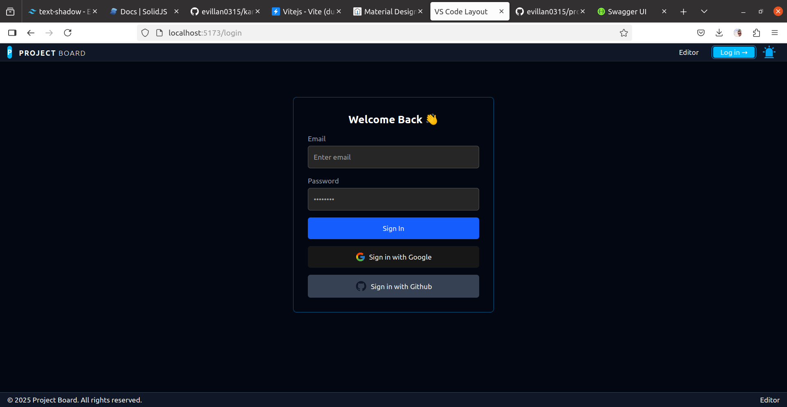
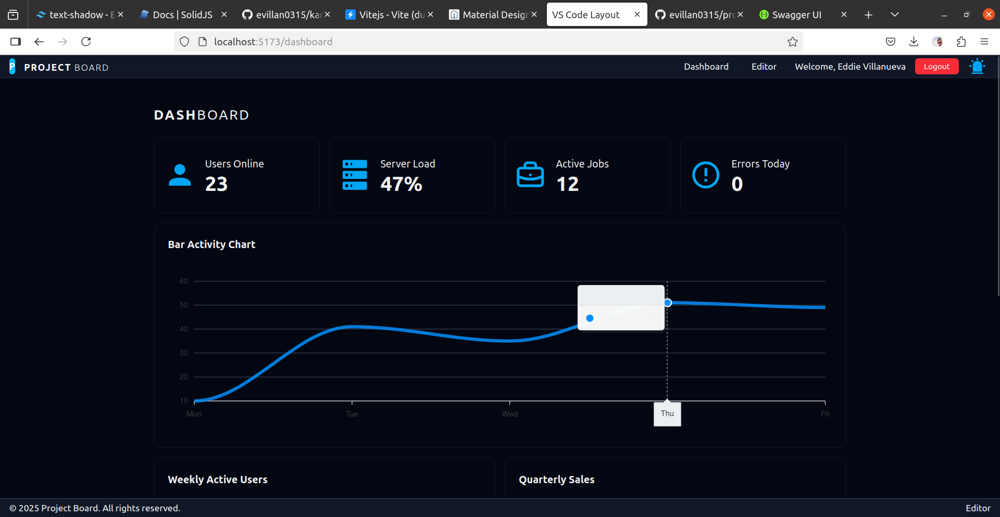

# Project Board

A developer-focused layout system interface, implemented using TypeScript, Vite, and modern frontend technologies (React and SolidJS). The structure is highly modular and theme-aware, suitable for building extensible applications with sidebar navigation, a collapsible layout, and content-based routing.

---

## 📸 Screenshots

| Login Page | Homepage | Dashboard |
|------------|----------|-----------|
|  |  |  |

---

## 📁 Project Structure

```

project-board/
│
├── .gitignore
├── README.md
├── index.html
├── package.json
├── pnpm-lock.yaml
├── pnpm-workspace.yaml
├── prettier.config.cjs
│
├── dist/                          # Compiled output files
│   ├── *...slug*-Dt0TiDlw\.js
│   ├── index-G72cJpw\_.js
│   ├── index.js
│   └── vscode-layout.css
│
├── libs/                          # Utility scripts
│   ├── generateStructure.ts
│   └── generateStructureRunner.ts
│
├── src/                           # Application source
│   ├── App.tsx
│   ├── app.css
│   │
│   ├── components/                # Reusable UI components
│   │   ├── Editor.tsx
│   │   ├── FeatureCard.tsx
│   │   ├── Hero.tsx
│   │   ├── Loading.tsx
│   │   ├── LoginForm.tsx
│   │   ├── Logo.tsx
│   │   ├── MetricCard.tsx
│   │   ├── SignInWithGithub.tsx
│   │   ├── SignInWithGoogle.tsx
│   │   ├── ThemeToggle.tsx
│   │   ├── docs/
│   │   │   └── DocPageList.tsx
│   │   ├── layouts/               # Layout structure and navigation
│   │   │   ├── Footer.tsx
│   │   │   ├── Header.tsx
│   │   │   ├── Layout.tsx
│   │   │   ├── LeftSidebar.tsx
│   │   │   ├── MobileNav.tsx
│   │   │   ├── Nav.tsx
│   │   │   ├── RightSidebar.tsx
│   │   │   ├── types.ts
│   │   │   └── content/
│   │   │       ├── Content.tsx
│   │   │       ├── ContentHeader.tsx
│   │   │       └── ContentLayout.tsx
│   │   ├── pages/                 # Application pages
│   │   │   ├── DynamicPage.tsx
│   │   │   ├── Page.tsx
│   │   │   ├── PageHeader.tsx
│   │   │   └── PageSection.tsx
│   │   └── routes/
│   │       └── ProtectedRoute.tsx
│   │
│   ├── configs/                   # Configuration files (empty)
│   ├── contexts/                 # React context providers
│   │   ├── AuthContext.tsx
│   │   └── ThemeProvider.tsx
│   └── data/                     # Static data files
│       ├── app.ts
│       └── menus.ts

```

---

## 🔧 Key Features

- **Visual Studio Code-like Layout**  
  Modular and flexible UI with collapsible sidebars, header, footer, and a content area.

- **Multi-framework Support**  
  React and SolidJS layout components supported side-by-side.

- **Context Management**  
  Theme and authentication context built-in.

- **Theme Toggle**  
  Dark/light mode supported using context and store.

- **Dynamic Pages**  
  Content and route-driven UI, with support for `[slug]` and `[...slug]` pages.

- **Authentication Docs**  
  Detailed markdown documentation for integrating OAuth (Google, GitHub).

- **File Structure Generator**  
  CLI-based utility (`generateStructure.ts`) to traverse and serialize the directory tree as JSON.

---

## 🚀 Scripts

Use `ts-node` to run the structure generator:

```bash
npx ts-node generateStructureRunner.ts .
```

This will create a `structure.json` file representing the current file layout.

---

## 📄 Authentication Documentation

Located under `src/docs/authentication/`:

* `google-auth-Integration.md`
* `github-auth-integration.md`

---

## 📦 Tooling & Stack

* **Language:** TypeScript
* **Bundler:** Vite
* **Frameworks:** React, SolidJS (experimental)
* **Package Manager:** pnpm
* **UI:** Tailwind CSS
* **Context Store:** React Context API + custom stores

---

# 🧠 Developer Workspace – Editor & Text-to-Speech Suite

Welcome to the **Developer Workspace**, a robust, web-based IDE and communication toolkit built with **SolidJS**, **Tailwind CSS**, and **Node/NestJS** backend services. This suite combines a powerful file editor and terminal interface with an interactive **Text-to-Speech (TTS)** engine to help you code, test, and communicate faster.

---

## 🚀 Features Overview

### 🖥️ Editor Interface

An intuitive, browser-based coding workspace that emulates the experience of Visual Studio Code:

- 📁 **File Manager** – Browse and select project files in a collapsible sidebar
- ✍️ **Monaco Editor Integration** – Syntax highlighting, autocomplete, and rich editing support
- 📐 **Resizable Layouts** – Dynamically adjust editor and sidebar dimensions
- 💻 **Terminal Drawer** – Embedded `xterm` terminal for running shell commands
- 📦 **Server Integration** – File read/write operations via REST endpoints

### 🔊 Text-to-Speech (TTS)

An interactive TTS form that converts written prompts into downloadable audio:

- 📝 **Prompt Input** – Enter any message to synthesize speech
- 🌍 **Language Selector** – Choose from 20+ languages and dialects
- 🧑‍🎤 **Speaker Configuration** – Assign voice profiles to multiple speakers
- 🎧 **Playback & Download** – Preview audio in-browser or save locally
- 🌐 **API-Driven** – Backed by a RESTful `/google-tts/generate` service

---

## 🧑‍💻 Tech Stack

### Frontend

- [SolidJS](https://solidjs.com/) – Reactive UI framework
- [Tailwind CSS](https://tailwindcss.com/) – Utility-first CSS framework
- [xterm.js](https://xtermjs.org/) – Terminal emulation
- [Monaco Editor](https://microsoft.github.io/monaco-editor/) – Code editing

### Backend

- [NestJS](https://nestjs.com/) – Scalable Node.js server framework
- [Google Cloud Text-to-Speech API](https://cloud.google.com/text-to-speech)
- RESTful API for file and speech handling

---


## 📡 Backend Setup

Ensure the following endpoints are functional:

* `POST /file/read` – Reads file content for editor
* `POST /google-tts/generate` – Processes TTS requests

These endpoints are typically provided by a NestJS backend (setup instructions should be included in that repo).

---

## 🧪 Usage

### Editor

```tsx
import Editor from './pages/editor';

function App() {
  return <Editor />;
}
```

### Text-to-Speech

```tsx
import TTSForm from './components/TTSForm';

function App() {
  return <TTSForm />;
}
```

---

## 📜 Example TTS Request

```json
POST /google-tts/generate

{
  "prompt": "Hello world!",
  "languageCode": "en-US",
  "speakers": [
    { "speaker": "Eddie", "voiceName": "Kore" },
    { "speaker": "Marionette", "voiceName": "Puck" }
  ]
}
```

On success, it returns a `200 OK` with an `audio/wav` binary file.

---

## 🛠️ Roadmap

* [ ] Toggleable terminal drawer
* [ ] TTS streaming with WebSockets
* [ ] Syntax-aware code analysis in editor
* [ ] TTS voice tone previews
* [ ] Theme and accessibility enhancements

---

## 🤝 Contributing

We welcome contributions! Please open an issue or submit a PR with improvements or new features.

1. Fork the repo
2. Create your feature branch (`git checkout -b feat/new-feature`)
3. Commit your changes (`git commit -am 'feat: add new feature'`)
4. Push to the branch (`git push origin feat/new-feature`)
5. Open a pull request

---

## 📄 License

MIT License © \[Eddie Villanueva]

---

## 📫 Contact

For questions, suggestions, or support, please open an issue or email [evillan0315@gmail.com](mailto:evillan0315@gmail.com)


## 🛠️ Planned Enhancements

* Populate `configs/` with environment and runtime configs
* Expand `stores/` and `utils/` for shared logic
* Support SSR or static builds for docs
* Extend authentication system


